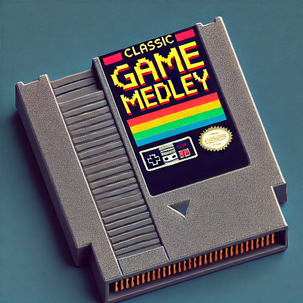

# Game Medley
so a hub for the games that I develop to practice Python skills

## 1. Guess the number
You can choose between the two options:
### 1. You're guessing the number generated by the program based on the hints
### 2. Program is guessing the number based on your hints

## 2. Rock, paper, scissors
For every round the computer makes a pre-choice, it let's you make your choice and compares the results
You can choose between the game modes:
Best of 3
Best of 5
Best of 10